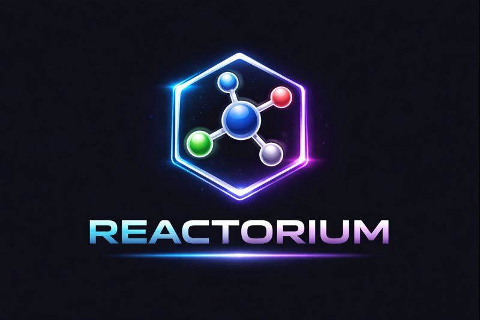

# 🧪 REACTORIUM 2.o
### An Experimental AI-Driven Chemical Reasoning System
<!-- 

  

 -->

**REACTORIUM** is an experimental hybrid **Rule-Based + Machine Learning** system designed to explore how artificial intelligence can *reason* about chemistry rather than only predict outcomes.

The project integrates **symbolic chemical rules**, **natural language understanding**, **reaction constraints**, and **machine learning fallback models**, along with **3D molecular visualization** for interpretability.

> ⚠️ This project is **educational and experimental** in nature.  
> It is **not intended for real-world chemical synthesis, laboratory use, or medical applications**.

---

## 🔬 Project Overview

REACTORIUM simulates how chemical components interact under different reaction conditions such as:

- Acidic / Basic environments  
- Heat  
- Oxidation / Reduction  

Unlike purely data-driven approaches, the system first applies **explicit chemical reasoning rules**, then falls back to **machine learning predictions** when rules are insufficient.

---

## 🧠 System Architecture

User Input
↓
NLP Parser
↓
Component & Constraint Extraction
↓
Chemical Reasoning Engine (Rule-Based)
↓
ML Predictor (Fallback)
↓
3D Structure Generation
↓
Interactive Visualization

---

## 🧪 Key Features

- ✅ Component-based chemical reasoning
- ✅ Reaction condition awareness (acidic, heat, oxidizing, reducing)
- ✅ Rule-driven logic with ML fallback
- ✅ Natural language input support
- ✅ Interactive 3D molecular visualization
- ✅ Modular architecture (NLP, Brain, ML, Visualization)
- ✅ Clean separation of frontend and backend

---

## 🧠 Core Technologies

### Frontend
- React.js
- JavaScript
- HTML / CSS
- 3Dmol.js (3D molecular visualization)

### Backend
- FastAPI
- Python
- Rule-based reasoning engine
- NLP parser for chemical text
- Machine Learning predictor (fallback)

### AI & Logic
- Symbolic AI (rule-based reasoning)
- Machine Learning (confidence-based fallback)
- Constraint resolution system
- Reaction logic engine

---

## ⚠️ Disclaimer

REACTORIUM is an **experimental AI system** created for learning and research purposes only.

- ❌ Not chemically validated  
- ❌ Not suitable for laboratory synthesis  
- ❌ Not intended for medical or industrial use  

All outputs are **simulated interpretations**, not real chemical guarantees.

---

## 🚀 Future Scope

- 🔹 Multi-step reaction pathway reasoning
- 🔹 Reaction explanation engine (why a compound formed)
- 🔹 Reaction graph & pathway visualization
- 🔹 Knowledge-graph based chemical memory
- 🔹 Continual learning from user feedback
- 🔹 Advanced constraints (pressure, catalysts, solvents)
- 🔹 Exportable reaction reports
- 🔹 Benchmarking rule-based vs ML reasoning

---

## 👨‍💻 Author

**Dhruvil Dave**  
AI & Machine Learning Enthusiast  
Experimental Systems • Symbolic AI • Chemical Reasoning  

---

## 📜 License

This project is released for **educational and research purposes**.  
Please provide appropriate credit if reused or extended.

---

## ⭐ Acknowledgements		

Inspired by the idea of combining **symbolic reasoning with machine learning** to build interpretable AI systems.

Built with curiosity, patience, and a lot of debugging. 🧠🧪	
